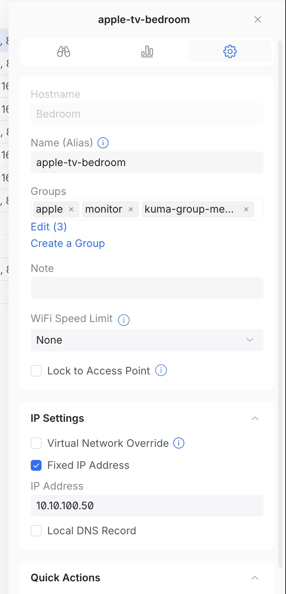

# unifi-kuma

[](https://github.com/johntdyer/unifi-kuma/actions/workflows/test.yml)
[](https://codecov.io/gh/johntdyer/unifi-kuma)
[](https://goreportcard.com/report/github.com/johntdyer/unifi-kuma)
[](https://golang.org/)
[](LICENSE)

Automatically create and manage [Uptime Kuma](https://github.com/louislam/uptime-kuma) monitors from [UniFi](https://ui.com/) network **Groups**.

Add a device or client to your UniFi `monitor` group (or whatever you name it), and unifi-kuma creates a ping monitor for it in Uptime Kuma — sorted into a matching Kuma group if it also belongs to another UniFi group (e.g. `servers`), or **Ungrouped** otherwise. Everything stays in sync on a configurable interval.

Inspired by [autokuma](https://github.com/BigBoot/AutoKuma), but source-of-truth is your UniFi controller rather than Docker labels.

---

## Requirements

| Component | Minimum version |
|-----------|----------------|
| UniFi OS / Network Application | 3.x / 8.x (Groups API required) |
| Uptime Kuma | any recent version |
| Go (to build from source) | 1.25 |

> Uptime Kuma has no REST API for managing monitors — the web UI (and this tool) talks to it over Socket.IO. unifi-kuma connects the same way, via [`github.com/breml/go-uptime-kuma-client`](https://github.com/breml/go-uptime-kuma-client).

---

## How it works

UniFi's **Groups** feature (Clients/Devices → Groups in the UI) lets you build named, reusable collections of devices/clients — people commonly also use Groups for unrelated things like firewall rules or VLAN assignment, so unifi-kuma only pays attention to two specific kinds of group membership, both opt-in:

1. On startup (and every `SYNC_INTERVAL_SECONDS`), unifi-kuma fetches all UniFi Groups and finds the one named `SYNC_MONITOR_GROUP` (default: `monitor`) — membership in it is the on/off switch for "should this get a ping monitor".
2. For each member of that group, it checks which *other* UniFi group(s) that member also belongs to whose name starts with `SYNC_GROUP_PREFIX` (default: `kuma-group`, so e.g. `kuma-group-servers`) — that determines which Kuma group its monitor lands in (the prefix is stripped: `kuma-group-servers` → **Servers**). Groups without that prefix are ignored for this purpose, even if the device is a member. A member of `monitor` with no matching prefixed group lands under **Ungrouped**. A member of more than one matching group gets a monitor created under each one.
3. For every monitorable device/client it creates a **ping monitor** inside the matching Kuma group — using the device's management IP. If a monitor already exists for that device, its full configuration (hostname, interval, retries, active status) is reconciled to match every cycle — so an IP change in UniFi (e.g. a DHCP lease renewal) reaches an already-synced monitor instead of leaving it pointed at a stale address forever. This means any manual edit you make to a managed monitor directly in the Kuma UI (e.g. changing its interval) will be reverted on the next sync — managed monitors are meant to be fully owned by unifi-kuma's config, not hand-tuned.
4. Devices are matched to their existing Kuma monitor by MAC address (embedded in the monitor's description), not by name, and groups are matched by the source UniFi group's stable ID (also embedded in the group monitor's description) rather than by its current display name — so renaming a client or a `{groupPrefix}-{name}` group in UniFi renames the matching monitor/group in Kuma in place on the next sync, instead of creating a new one under the new name and leaving the old one behind as an orphan.
5. Monitors — both the device ping monitors and the groups themselves — are labelled `unifi-kuma` so they can be tracked for optional orphan deletion and safe duplicate cleanup (see below); anything you create by hand in Kuma is never touched, even if it happens to share a name. This label (and any tags from `SYNC_TAG_OTHER_GROUPS`, below) is also **backfilled** onto monitors and groups that already existed before tagging picked them up — e.g. Kuma monitors created by an older version of unifi-kuma, or a group that was found rather than newly created — so nothing is left permanently untagged just because of when it was first synced.
6. If a device that was previously **Ungrouped** later gains a matching prefixed group, its stale Ungrouped monitor is removed automatically on the next sync — this always happens, independent of `SYNC_DELETE_ORPHAN`, since it's just cleaning up the same device's own outdated placement.
7. If Kuma ever ends up with two group monitors sharing the same name, or two managed device monitors for the same device under the same group (from a historical bug, or a race between separate process instances), unifi-kuma treats the lowest-ID one as canonical and automatically removes the duplicate(s) — always, independent of `SYNC_DELETE_ORPHAN`. Unmanaged monitors you created by hand are never touched, even if they happen to share a name.

Optionally, set `SYNC_TAG_OTHER_GROUPS=true` to also tag each device's monitor with the name of every *other* UniFi group it belongs to — beyond the monitor-flag group and any `SYNC_GROUP_PREFIX`-matching group, which already determine tagging/grouping structurally. For example, a client that's a member of `monitor`, `kuma-group-media`, and `apple` ends up with the Kuma tags `unifi-kuma` and `apple` (`kuma-group-media` only affects which Kuma group it lands in — it's not itself a tag, and `monitor` is just the on/off switch). This is off by default since it can add a lot of tags if you use UniFi Groups heavily for other purposes (VLANs, firewall rules, etc.).

These other-group tags are created with no color (Kuma's default) unless `SYNC_OTHER_GROUPS_TAG_COLOR` is set to one of `gray`, `red`, `orange`, `blue`, `indigo`, `purple`, or `pink` — matching the color names in Kuma's own tag color picker, so the tag looks the same whether it was created by unifi-kuma or picked by hand in the UI. If the tag already existed with a different color (e.g. it was created before this setting was configured, or with a different value), it's recolored to match on the next sync — an empty `SYNC_OTHER_GROUPS_TAG_COLOR` (the default) never touches a tag's existing color, whatever it is.

Kuma group names are title-cased by default (`kuma-group-servers` → **Servers**); set `SYNC_HUMANIZE_GROUP_NAMES=false` to use the raw suffix verbatim instead (`servers`).

### Example

```
UniFi Groups
  monitor              → members: router, nas, thermostat
  kuma-group-servers   → members: router, nas
  kuma-group-iot       → members: thermostat
  apple                → members: router          (no "kuma-group-" prefix — ignored)

Uptime Kuma result
  📁 Servers
    ● router       (ping 192.168.1.1)
    ● nas          (ping 192.168.1.10)
  📁 Iot
    ● thermostat   (ping 10.0.1.50)
```

---

## Quick start

### Docker (recommended)

Neither UniFi nor Uptime Kuma can be authenticated with an API key for what this tool needs (see [Authentication](#authentication) for why) — both use username/password:

```bash
docker run -d \
  --name unifi-kuma \
  --restart unless-stopped \
  -e UNIFI_URL=https://192.168.1.1 \
  -e UNIFI_USERNAME=unifi-kuma \
  -e UNIFI_PASSWORD=changeme \
  -e KUMA_URL=http://uptime-kuma:3001 \
  -e KUMA_USERNAME=admin \
  -e KUMA_PASSWORD=changeme \
  ghcr.io/johntdyer/unifi-kuma:latest
```

If your Kuma instance runs with "Disable Auth" enabled, skip Kuma credentials entirely:

```bash
docker run -d \
  --name unifi-kuma \
  --restart unless-stopped \
  -e UNIFI_URL=https://192.168.1.1 \
  -e UNIFI_USERNAME=unifi-kuma \
  -e UNIFI_PASSWORD=changeme \
  -e KUMA_URL=http://uptime-kuma:3001 \
  -e KUMA_DISABLE_AUTH=true \
  ghcr.io/johntdyer/unifi-kuma:latest
```

### Docker Compose

```yaml
services:
  unifi-kuma:
    image: ghcr.io/johntdyer/unifi-kuma:latest
    restart: unless-stopped
    environment:
      UNIFI_URL: https://192.168.1.1
      UNIFI_USERNAME: unifi-kuma      # see "Creating a read-only UniFi user" below
      UNIFI_PASSWORD: changeme
      UNIFI_INSECURE: "true"          # if using self-signed cert
      KUMA_URL: http://uptime-kuma:3001
      KUMA_USERNAME: admin
      KUMA_PASSWORD: changeme
      # KUMA_DISABLE_AUTH: "true"     # instead of username/password, if Kuma has auth disabled
      SYNC_MONITOR_GROUP: monitor
      SYNC_GROUP_PREFIX: kuma-group
      # SYNC_HUMANIZE_GROUP_NAMES: "false"  # keep raw names (e.g. "servers") instead of "Servers"
      # SYNC_TAG_OTHER_GROUPS: "true"       # also tag monitors with the device's other UniFi group names
      # SYNC_OTHER_GROUPS_TAG_COLOR: "purple"  # gray, red, orange, blue, indigo, purple, or pink
      SYNC_INTERVAL_SECONDS: "300"
      SYNC_DRY_RUN: "false"
      SYNC_DELETE_ORPHAN: "false"
```

### Build from source

```bash
git clone https://github.com/johntdyer/unifi-kuma.git
cd unifi-kuma
make build          # binary at ./dist/unifi-kuma
./dist/unifi-kuma -help
```

---

## Configuration

All settings can be provided as environment variables or via a YAML file. Environment variables take precedence over the file.

### Authentication

Neither UniFi nor Uptime Kuma can be authenticated with an API key for what this tool actually needs, so both use username+password:

- **UniFi**: set `UNIFI_USERNAME`/`UNIFI_PASSWORD`. UniFi API keys only work against its newer public Integrations API, which doesn't expose Groups at all — the thing this tool is built around — so a real login (the same session-based auth the web UI itself uses) is the only way to read them. See [Creating a read-only UniFi user](#creating-a-read-only-unifi-user) below for a scoped-down account instead of using your main admin login.
- **Uptime Kuma**: set `KUMA_USERNAME`/`KUMA_PASSWORD` — the same credentials you use to log into the Kuma web UI. (Kuma API keys only cover its push/badge REST endpoints, not the Socket.IO connection this tool uses for monitor management, so they can't be used here either.)
- **Uptime Kuma with "Disable Auth" enabled**: set `KUMA_DISABLE_AUTH=true` instead. Kuma instances with authentication disabled (Settings → Security → Disable Auth) reject any login attempt, so `KUMA_DISABLE_AUTH=true` connects without sending credentials at all. `KUMA_USERNAME`/`KUMA_PASSWORD` are not needed in this mode.

Validation requires both username and password for UniFi; for Kuma, either both username and password, or `KUMA_DISABLE_AUTH=true`.

### Environment variables

| Variable | Default | Description |
|---|---|---|
| `UNIFI_URL` | *(required)* | Controller base URL |
| `UNIFI_USERNAME` | *(required)* | UniFi username — see [read-only user](#creating-a-read-only-unifi-user) |
| `UNIFI_PASSWORD` | *(required)* | UniFi password |
| `UNIFI_SITE` | `default` | UniFi site name |
| `UNIFI_INSECURE` | `false` | Skip TLS certificate verification |
| `KUMA_URL` | *(required)* | Uptime Kuma base URL |
| `KUMA_USERNAME` | *(required if no no-auth)* | Kuma username |
| `KUMA_PASSWORD` | *(required if no no-auth)* | Kuma password |
| `KUMA_DISABLE_AUTH` | `false` | Connect without credentials, for instances with "Disable Auth" enabled |
| `SYNC_MONITOR_GROUP` | `monitor` | Name of the UniFi Group whose members should be monitored |
| `SYNC_GROUP_PREFIX` | `kuma-group` | Prefix identifying which other UniFi groups determine Kuma grouping (e.g. `kuma-group-servers`) |
| `SYNC_HUMANIZE_GROUP_NAMES` | `true` | Title-case Kuma group names (`servers` → `Servers`); set `false` to use raw names verbatim |
| `SYNC_TAG_OTHER_GROUPS` | `false` | Tag each device's monitor with the name of every other UniFi group it belongs to (besides the monitor-flag and prefix-matching groups) |
| `SYNC_OTHER_GROUPS_TAG_COLOR` | *(Kuma default)* | Color for tags created by `SYNC_TAG_OTHER_GROUPS`: one of `gray`, `red`, `orange`, `blue`, `indigo`, `purple`, `pink` |
| `SYNC_INTERVAL_SECONDS` | `300` | Seconds between sync cycles |
| `SYNC_DRY_RUN` | `false` | Log planned actions without applying them |
| `SYNC_DELETE_ORPHAN` | `false` | Delete monitors with no matching UniFi device |
| `SYNC_CLIENT_TTL_DAYS` | `0` (disabled) | Skip a group member if its underlying UniFi client hasn't been seen for this many days — see [Troubleshooting](#a-monitor-keeps-coming-back-after-i-delete-it--even-with-sync_delete_orphantrue) |

### YAML config file

```yaml
unifi:
  url: https://192.168.1.1
  username: unifi-kuma
  password: changeme
  site: default
  insecure: true

kuma:
  url: http://uptime-kuma:3001
  username: admin
  password: changeme
  # disable_auth: true   # instead of username/password, if Kuma has auth disabled

sync:
  monitor_group: monitor
  group_prefix: kuma-group
  # humanize_group_names: false   # keep raw names (e.g. "servers") instead of "Servers"
  # tag_other_groups: true        # also tag monitors with the device's other UniFi group names
  # other_groups_tag_color: purple  # gray, red, orange, blue, indigo, purple, or pink
  interval_seconds: 300
  dry_run: false
  delete_orphan: false
  # client_ttl_days: 45   # skip group members not seen in this many days (0 = disabled)
```

Pass with `-config /path/to/config.yaml`.

### Creating a read-only UniFi user

unifi-kuma only reads data from UniFi (groups, devices, clients) — it never changes anything on your controller — so it doesn't need a full admin account. Create a scoped-down local user instead of using your primary admin login:

1. On the **UniFi OS console** (not inside the Network app itself), go to **Settings → Admins & Users**.
2. Click **Add Admin** (or **+ Add User**) → choose to create a **local user** — look for a "restrict to local access only" option so this doesn't become a full Ubiquiti cloud (SSO) account with broader reach than your controller.
3. Give it a username and password — these become `UNIFI_USERNAME`/`UNIFI_PASSWORD`.
4. Under application permissions, set the **Network** application role to **View Only** (read-only). Set any other applications (Protect, Access, Talk, etc.) to **None** — unifi-kuma doesn't touch them.
5. Save, and use these credentials in your config.

> Exact menu wording varies a bit by UniFi OS/firmware version. If sync fails with a permissions error under the **View Only** role, the internal API this tool uses may require the fuller **Admin** role for the Network application specifically — this hasn't been verified against every controller version, so try that as a fallback and let us know which one your setup actually needs.

### CLI flags

```
-config string      path to YAML config file
-log-level string   log level: debug, info, warn, error (default "info")
-log-json           output logs as JSON
-version            print version and exit
```

---

## Setting up Groups in UniFi

1. In **UniFi Network**, go to **Clients** (or **Devices**) → **Groups**.
2. Create a group named `monitor` (or whatever you set `SYNC_MONITOR_GROUP` to) and add every device/client you want a ping monitor for.
3. Optionally, create additional groups **named with the `kuma-group-` prefix** (or whatever you set `SYNC_GROUP_PREFIX` to) — e.g. `kuma-group-servers`, `kuma-group-iot` — and add the same devices/clients to them too. That's what determines which Kuma group each monitor lands in (the prefix is stripped from the Kuma group name). Groups without this prefix are ignored for grouping purposes, so it's safe to reuse UniFi Groups you already have for firewall rules, VLANs, etc. without them accidentally creating Kuma groups. Skip this step entirely if you're fine with everything landing under **Ungrouped**.
4. unifi-kuma will pick up the change on the next sync cycle.

> **Note:** This uses UniFi's internal Groups API (`/proxy/network/v2/api/site/{site}/network-members-groups`), the same one the web UI itself uses — undocumented by Ubiquiti, so exact availability may vary by controller/firmware version.



A client assigned to `monitor` + `kuma-group-media` + `apple` this way gets a ping monitor created in Kuma's **Media** group, tagged `unifi-kuma` (and also `apple`, if `SYNC_TAG_OTHER_GROUPS=true`).

---

## Troubleshooting

### A monitor keeps coming back after I delete it — even with `SYNC_DELETE_ORPHAN=true`

**Symptom:** You delete a monitor in Kuma for a device that's long gone (unplugged, dead, replaced), it reappears on the next sync, and the device isn't even visible anywhere in the UniFi Network app's client list or the `monitor` group's member list in the UI.

**Cause:** unifi-kuma decides what to monitor purely from UniFi Group *membership*, not from whether a device is currently reachable (see [How it works](#how-it-works), step 1). UniFi doesn't automatically drop a client's MAC from a group's stored member list just because the client goes offline — and its own UI doesn't reliably render offline/stale members in group-membership screens, even though the membership is still there in the underlying data. So the client can be effectively invisible in the UniFi UI while still being a member of `monitor` (or a `kuma-group-*` group) as far as the API is concerned — which means unifi-kuma still considers it desired and keeps recreating its monitor, no matter how many times you delete it in Kuma or how you've set `SYNC_DELETE_ORPHAN`.

**Fix #1 — let unifi-kuma catch it automatically:** set `SYNC_CLIENT_TTL_DAYS` (or `sync.client_ttl_days` in YAML) to however many days of silence you're comfortable treating as "gone" — e.g. `45`. Any group member that resolves to a UniFi *client* (not an infrastructure device like a switch or AP — those are never skipped, since going offline is exactly what you want a monitor to catch for them) last seen longer ago than that is excluded from the desired set and logged as a warning, instead of getting a monitor created/recreated for it. Combined with `SYNC_DELETE_ORPHAN=true`, this fully closes the loop with no manual UniFi cleanup required — the stale monitor gets removed on the next sync and stays gone. It's off (`0`) by default because "not seen in N days" isn't always "gone" (a device can legitimately be powered off for a while), so pick a threshold that fits how your devices actually behave.

**Fix #2 — remove the device at the source, not in Kuma:** if you'd rather clean it up once and for all instead of relying on a time threshold:

1. In the UniFi Network app, go to **Clients** (or **Client Devices**) and search for the device by name. If it shows up (even as offline), select it and choose **Forget this client** (or unassign it from the `monitor`/`kuma-group-*` groups if you want to keep its history).
2. If it does **not** show up in the UI at all — which can happen — you have to reach it through the API directly, since there's no UI path to it:
   - Look up its MAC address. If you don't already know it, you can usually find it in your router's DHCP lease table, or by checking the group's raw member list via `GET https://<controller>/proxy/network/v2/api/site/<site>/network-members-groups` (requires an authenticated session cookie).
   - Forget the client by MAC:
     ```bash
     # 1. Log in and save the session cookie
     curl -k -c cookies.txt -X POST https://<controller>/api/auth/login \
       -H 'Content-Type: application/json' \
       -d '{"username":"<admin-user>","password":"<admin-pass>"}'

     # 2. Forget the client (repeat -d for multiple MACs in one call)
     curl -k -b cookies.txt -X POST \
       https://<controller>/proxy/network/api/s/<site>/cmd/stamgr \
       -H 'Content-Type: application/json' \
       -d '{"cmd":"forget-sta","macs":["aa:bb:cc:dd:ee:ff"]}'
     ```
     This is UniFi's legacy `stamgr` client-management command. It removes the client record (and, as a side effect, its membership in every group) even when the client no longer appears anywhere in the UI.
3. On the next unifi-kuma sync, the device drops out of the desired set. With `SYNC_DELETE_ORPHAN=true`, its monitor is removed automatically; otherwise, delete it manually in Kuma once — it won't come back.

**Going forward:** when you decommission a monitored device, forget it in UniFi (step 1/2 above) rather than only deleting its Kuma monitor. Deleting the monitor alone treats the symptom, not the cause — the underlying group membership is unifi-kuma's actual source of truth, and it can persist independently of what the UniFi UI shows you.

---

## Development

```bash
# Run all tests
make test

# Run tests with race detector + coverage
make test-cover

# Run tests in Docker (identical to CI)
make test-docker

# Start a local Uptime Kuma instance for manual testing
make dev-deps
# → Kuma available at http://localhost:3001

# Lint
make lint

# Show all targets
make help
```

---

## CI / CD

| Trigger | Action |
|---|---|
| Pull request | Run tests on Go 1.25, lint, build |
| Push / merge to `main` | Build multi-arch Docker image, push to GHCR as `latest` |
| Push a `v*` tag | Same, plus publish versioned tags (`v1.2.3`, `v1.2`, `v1`) |

Image: `ghcr.io/johntdyer/unifi-kuma`

---

## License

MIT
